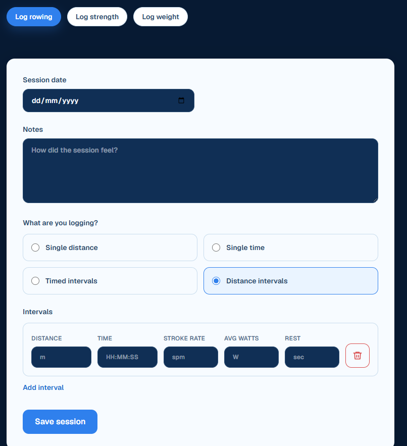
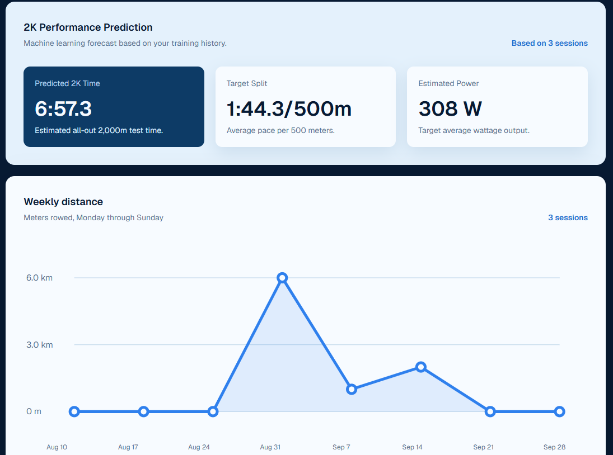

# Erg Master

A rowing tracker application built for rowers, by rowers.

## [Website Link](https://erg-master.vercel.app/)

## Overview

Erg Master is a full stack rowing tracker web application designed to help rowers keep track of their rowing, strength training and flexibility performance, all in one place. Users can record sessions in the app and visualise their progress. A Python-based machine learning model is used to predict future performance. Erg Master can therefore provide rowers with one single place to track all of their progress, rather than having to use separate apps.

## Images

### Logging

### Dashboard

## Implemented Features

### Logging Rowing Sessions
- Users can log rowing sessions
- Single distance, single time, timed intervals or distance intervals
- Notes can be added also

### Logging Strength Sessions
- Users can log strength training sessions
- Users can select exercise from bank (in future will be able to add more)
- Can add sets, reps, weight, rest, RPE

### Logging Weight
- Users can log their weight for a specific date, with notes
- A graph of this data can be seen on the dashboard

### View History
- Rowing and strength session history can be viewed on history page
- These sessions can also be edited or deleted

### Progress Page
- The progress page includes many sections to indictate progress
- Weekly distance
    - user can view their weekly rowing distance, which is tracked on a graph
- Streaks
    - weekly and daily streaks of activity
- Weight Trend
- 2k Performance Predictions

### 2k Performance Predictions
- An XGBoost model is used to predict performance based on a user's session history - 
    1. Total cumulative distance (meters)
    2. Total cumulative training time (seconds)
    3. Number of total workouts logged
    4. Average power output (watts) across all workouts
    5. Max power output (watts) across intervals
    6. Best (fastest) 500m pace in seconds across any interval
    7. Best (fastest) 2000m pace equivalent or 2k interval pace
    8. Recent 14-day training volume (meters)
    9. Recent 14-day average watts
    10. Consistency (standard deviation of daily training frequency or interval count)
- A synthetic dataset is used as training data - this should be replaced by a real dataset in future

### Strength Training Templates
- Templates for strength training sessions
- User can set a template with specified exercises and sets
- Can then easily create a workout from a template

### Authentication
- User sign-in, sign-up and authentication using BetterAuth
- Including Google sign in

## Stack

### Frontend
The frontend uses Next.js App Router
- Next.js
- React
- TypeScript
- TailwindCSS

### Database
- Neon Serverless Postgres

### Backend
Currently, this consists of the XGBoost 2k performance predictor in Python
This is accessible through the /predictions endpoint, using FastAPI
- Python
- FastAPI

### Development
- Git
- GitHub
- GitHub Actions

### Hosting
- Vercel (Frontend)
- Render (Backend)
- Docker

## Database Schema

### `rowing_sessions`

Stores one rowing workout for a user. This can be single distance, single time, timed intervals or distance intervals

| Field | Explanation |
| --- | --- |
| `id` | Unique identifier for the rowing session. |
| `user_id` | Better Auth user who logged the session. |
| `session_date` | Date the workout took place. |
| `session_type` | Workout format: single distance, single time, timed intervals, or distance intervals. |
| `notes` | Optional notes about the workout. |
| `created_at` | When the session record was created. |

### `rowing_intervals`

Stores the individual pieces of work that make up a rowing session. Each interval belongs to a rowing session.
A single distance/time rowing session is modelled as 1 interval
Interval sessions are modelled as multiple intervals
Split /500m is not stored and is instead calculated

| Field | Explanation |
| --- | --- |
| `id` | Unique identifier for the interval. |
| `rowing_session_id` | The rowing session this interval belongs to. |
| `interval_number` | Interval's position in the session. |
| `distance` | Distance rowed, in meters. |
| `time_seconds` | Time spent rowing, in seconds. |
| `avg_stroke_rate` | Average strokes per minute, when provided. |
| `avg_watts` | Average power, in watts, when provided. |
| `rest_time_seconds` | Rest after the interval, in seconds; zero for single-piece sessions. |
| `created_at` | When the interval record was created. |

### `strength_sessions`

Stores one strength workout for a user.
Strength sessions are made up of exercises, which in turn are made up of sets

| Field | Explanation |
| --- | --- |
| `id` | Unique identifier for the strength session. |
| `user_id` | Better Auth user who logged the session. |
| `session_date` | Date the workout took place. |
| `notes` | Optional notes about the workout. |
| `created_at` | When the session record was created. |

### `strength_session_exercises`

Lists the exercises performed in a strength session, in workout order.

| Field | Explanation |
| --- | --- |
| `id` | Unique identifier for this exercise entry in the session. |
| `strength_session_id` | The strength session this entry belongs to. |
| `exercise_id` | Exercise performed, referencing `exercises`. |
| `exercise_order` | Exercise's position in the workout. |
| `created_at` | When the exercise entry was created. |

### `strength_sets`

Stores set-level details for an exercise entry in a strength session.

| Field | Explanation |
| --- | --- |
| `id` | Unique identifier for the set. |
| `strength_session_exercise_id` | The exercise entry this set belongs to. |
| `set_number` | Set's position for that exercise. |
| `reps` | Number of repetitions completed. |
| `weight_kg` | Weight used, stored in kilograms. |
| `rest_time_seconds` | Rest after the set, in seconds, when provided. |
| `rpe` | User-reported rate of perceived exertion (0–10), when provided. |
| `created_at` | When the set record was created. |

### `exercises`

Exercise catalogue shared by workouts and templates. A nullable `user_id` distinguishes user-created exercises from shared exercises.

| Field | Explanation |
| --- | --- |
| `id` | Unique identifier for the exercise. |
| `name` | Exercise name. |
| `muscle_group` | Muscle group associated with the exercise. |
| `user_id` | Owner of a custom exercise; null for a shared exercise. |

### `strength_templates`

Stores a named reusable strength-workout template for a user.

| Field | Explanation |
| --- | --- |
| `id` | Unique identifier for the template. |
| `user_id` | Better Auth user who owns the template. |
| `name` | Template name. |
| `created_at` | When the template was created. |

### `strength_template_exercises`

Lists the exercises included in a strength template and the planned set count for each.

| Field | Explanation |
| --- | --- |
| `id` | Unique identifier for this template exercise entry. |
| `strength_template_id` | The template this entry belongs to. |
| `exercise_id` | Exercise included, referencing `exercises`. |
| `exercise_order` | Exercise's position in the template. |
| `target_sets` | Number of sets planned for the exercise. |

### `weight_entries`

Stores a user's body-weight measurement.

| Field | Explanation |
| --- | --- |
| `id` | Unique identifier for the measurement. |
| `user_id` | Better Auth user who recorded the measurement. |
| `weight_kg` | Weight value, stored in kilograms regardless of display preference. |
| `recorded_at` | Date the measurement was recorded. |
| `notes` | Optional notes about the measurement. |
| `created_at` | When the measurement record was created. |

### `user_settings`

Stores user-specific display preferences.

| Field | Explanation |
| --- | --- |
| `user_id` | Better Auth user these settings belong to. |
| `weight_unit` | Preferred weight display unit (`kg` or `lb`). |

### Better Auth tables

Better Auth generates and manages the following authentication tables and fields:

| Table | Explanation and fields |
| --- | --- |
| `user` | Stores account profile: `id` (user identifier), `name` (display name), `email` (email address), `emailVerified` (whether the email is verified), `image` (profile image URL), `createdAt` and `updatedAt` (record timestamps). |
| `session` | Stores active login sessions: `id` (session identifier), `expiresAt` (expiration time), `token` (session token), `createdAt` and `updatedAt` (record timestamps), `ipAddress` and `userAgent` (client metadata), `userId` (the signed-in user). |
| `account` | Stores linked sign-in provider credentials: `id` (account record identifier), `accountId` (provider account identifier), `providerId` (identity provider), `userId` (account owner), `accessToken`, `refreshToken`, and `idToken` (provider tokens), `accessTokenExpiresAt` and `refreshTokenExpiresAt` (token expiration times), `scope` (granted permissions), `password` (password credential when applicable), `createdAt` and `updatedAt` (record timestamps). |
| `verification` | Stores verification challenges: `id` (record identifier), `identifier` (email or other item being verified), `value` (verification token/code), `expiresAt` (expiration time), `createdAt` and `updatedAt` (record timestamps). |

# Planned Features

- Flexibility tracking
- Improved 2k predictions using rowing dataset, not just individual results
- Allow predictions for more distances
- Mobile app
- Import workouts from Concept2

